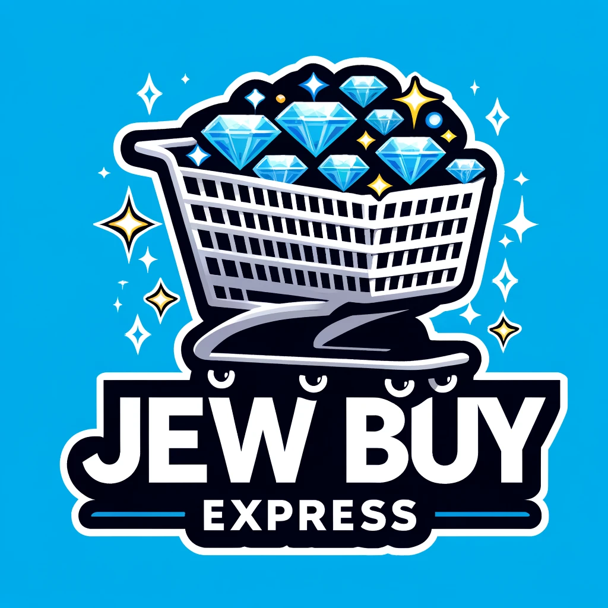

<!-- Improved compatibility of back to top link: See: https://github.com/othneildrew/Best-README-Template/pull/73 -->
<a name="readme-top"></a>
<!--
*** Thanks for checking out the Best-README-Template. If you have a suggestion
*** that would make this better, please fork the repo and create a pull request
*** or simply open an issue with the tag "enhancement".
*** Don't forget to give the project a star!
*** Thanks again! Now go create something AMAZING! :D
-->


<!-- PROJECT SHIELDS -->
<!--
*** I'm using markdown "reference style" links for readability.
*** Reference links are enclosed in brackets [ ] instead of parentheses ( ).
*** See the bottom of this document for the declaration of the reference variables
*** for contributors-url, forks-url, etc. This is an optional, concise syntax you may use.
*** https://www.markdownguide.org/basic-syntax/#reference-style-links
-->
[![Contributors][contributors-shield]][contributors-url]
[![Forks][forks-shield]][forks-url]
[![Stargazers][stars-shield]][stars-url]
[![Issues][issues-shield]][issues-url]
[![MIT License][license-shield]][license-url]
[![LinkedIn][linkedin-shield]][linkedin-url]


<!-- PROJECT LOGO -->
<br />
<div align="center">
  <a href="https://github.com/Daniel-Ayz/JewBuyExpress">
    
  </a>

<h3 align="center">JewBuyExpress</h3>

  <p align="center">
    Same as superly but better. Soon will be available online! Watch out Jeff, the jews are comming!
    <br />
    <a href="https://github.com/Daniel-Ayz/JewBuyExpress/tree/main/docs"><strong>Explore the docs »</strong></a>
    <br />
    <br />
    <a href="https://github.com/Daniel-Ayz/JewBuyExpress">View Demo</a>
    ·
    <a href="https://github.com/Daniel-Ayz/JewBuyExpress/issues/new?labels=bug&template=bug-report---.md">Report Bug</a>
    ·
    <a href="https://github.com/Daniel-Ayz/JewBuyExpress/issues/new?labels=enhancement&template=feature-request---.md">Request Feature</a>
  </p>
</div>


<!-- GETTING STARTED -->
## Installation

### Create a Virtualenv

- Windows
Commands might be different (backslashes maybe).
it will probably be the same


- Linux/mac

```bash
  pip install venv
  python3 venv -m .venv 
  source .venv/bin/activate
```

You may need to configure your IDE (such as VSCode) to use the virtualenv python interpreter, as well as your IDE linter.

### Install Requirements

```bash
  pip install -r requirements.txt
```

> Note: if you install new packages, please update the requirements.txt file with `pip freeze > requirements.txt`

### Install Pre-Commit Hooks

This will install pre-commit hooks that will run automatically before each commit to make sure that the code is formatted correctly and that there are no errors.

```bash
  pre-commit install
```

### Start Up server
For the first time:
```bash
  python manage.py migrate
```

```bash
  python manage.py runserver
```

The application should be available at http://localhost:8000/ through your browser


## Pydantic

Read briefly about it in the [official docs](https://pydantic-docs.helpmanual.io/). \
We won't use it directly, but it is used by Django Ninja Schemes support.

## Django API Platform

We chose Django Ninja, make sure to read about it in the [official docs](https://django-ninja.rest-framework.com/). It supports OpenAPI (previously known as Swagger) and [JSON Schema](https://json-schema.org/), as well as [Pydantic](https://pydantic-docs.helpmanual.io/) models. It also has an ["extra" package](https://eadwincode.github.io/django-ninja-extra/) that adds some useful features.


### Tutorials

Please follow the following tutorials to get started:

- [Short Introduction to Django](https://youtu.be/nGIg40xs9e4)
- [Official Tutorial](https://django-ninja.rest-framework.com/tutorial/)
- [Django Ninja Video Tutorial](https://www.youtube.com/playlist?list=PLXskueZ7apWgNasQPt6PYhlKNKNEghT3T)
- [Django Ninja Extra Tutorial](https://eadwincode.github.io/django-ninja-extra/tutorial/)
- [Django Ninja with Pydantic](https://testdriven.io/blog/django-and-pydantic/)

### Project Examples

Please read and understand some of the following project architectures:

- [Books Example](https://github.com/ErSauravAdhikari/Karnali), only API example (good structure).
- [Blog Example](https://github.com/HyoungSooo/Django-Blog) with JWT (API), and blog (templates)
- [Django Ninja Example](https://github.com/lihuacai168/django-ninja-demo/) with some config files (such as dockerfile, env example, etc.)

## Style and Conventions Guides

- [Hitchhiker's Guide to Python](https://docs.python-guide.org/writing/style/)
- [Django Best Practices](https://medium.com/@sadhanajaiswal/django-best-practices-coding-style-7870b398889b)
- Make sure to install the pre-commit hooks as explained above.

## Feature Submissions Guidelines

- First, create an issue with the feature request in GitHub, assign it to yourself (or the relevant people), and add the relevant labels (such as "enhancement", "bug", etc.)
- Then, create a branch automatically from the issue. The branch name should be `feature/requirement_num/feature_name` (e.g. `feature/2-2/profile-editing`). The "feature" can be replaced with "bug" if needed. Requirement_num is from the clickup documentation.
- Fetch the remote branch and start working on it locally.
- Commit and push your changes frequently to the remote branch.
- When you are done, make `git pull origin main` (to your branch) to merge the changes done in main since your branch was created. Solve conflicts carefully if there are any.  
- Create a pull request from the remote branch to the main branch. Add the relevant reviewers (>2) and assign the pull request to yourself. Assign to the relevant milestone.
- If the pull request is approved, it will be merged into the main branch and the remote branch will be deleted by the reviewer.


<!-- ROADMAP -->
## Roadmap

- [ ] Release Version 0
    - [X] Add acceptence tests
    - [ ] Add use cases
    - [ ] Add class diagrams
- [ ] Release Version 1
    - [ ] Initial backend
    - [ ] Initial frontend
- [ ] Release Version 2
- [ ] Release Version 3
- [ ] Release Final Version

See the [open issues](https://github.com/Daniel-Ayz/JewBuyExpress/issues) for a full list of proposed features (and known issues).

<p align="right">(<a href="#readme-top">back to top</a>)</p>


<!-- CONTRIBUTING -->
## Contributing

Contributions are what make the open source community such an amazing place to learn, inspire, and create. Any contributions you make are **greatly appreciated**.

If you have a suggestion that would make this better, please fork the repo and create a pull request. You can also simply open an issue with the tag "enhancement".
Don't forget to give the project a star! Thanks again!

1. Fork the Project
2. Create your Feature Branch (`git checkout -b feature/AmazingFeature`)
3. Commit your Changes (`git commit -m 'Add some AmazingFeature'`)
4. Push to the Branch (`git push origin feature/AmazingFeature`)
5. Open a Pull Request

<p align="right">(<a href="#readme-top">back to top</a>)</p>


<!-- LICENSE -->
## License

Distributed under the MIT License. See `LICENSE.txt` for more information.

<p align="right">(<a href="#readme-top">back to top</a>)</p>


<!-- CONTACT -->
## Contact

Daniel Ayzenshteyn - ayzendan@post.bgu.ac.il  
Ron Shefland - ronshef@post.bgu.ac.il  
Daniel Erbesfeld - erbesfel@post.bgu.ac.il  
Itai Pemper - itaipem@post.bgu.ac.il  
Roy Weiss - weissroy@post.bgu.ac.il  
Roy Shvartz - royshv@post.bgu.ac.il  
Talia Katrih - katrihta@post.bgu.ac.il

Project Link: [https://github.com/Daniel-Ayz/JewBuyExpress](https://github.com/Daniel-Ayz/JewBuyExpress)

<p align="right">(<a href="#readme-top">back to top</a>)</p>


<!-- MARKDOWN LINKS & IMAGES -->
<!-- https://www.markdownguide.org/basic-syntax/#reference-style-links -->
[contributors-shield]: https://img.shields.io/github/contributors/Daniel-Ayz/JewBuyExpress.svg?style=for-the-badge
[contributors-url]: https://github.com/Daniel-Ayz/JewBuyExpress/graphs/contributors
[forks-shield]: https://img.shields.io/github/forks/Daniel-Ayz/JewBuyExpress.svg?style=for-the-badge
[forks-url]: https://github.com/Daniel-Ayz/JewBuyExpress/network/members
[stars-shield]: https://img.shields.io/github/stars/Daniel-Ayz/JewBuyExpress.svg?style=for-the-badge
[stars-url]: https://github.com/Daniel-Ayz/JewBuyExpress/stargazers
[issues-shield]: https://img.shields.io/github/issues/Daniel-Ayz/JewBuyExpress.svg?style=for-the-badge
[issues-url]: https://github.com/Daniel-Ayz/JewBuyExpress/issues
[license-shield]: https://img.shields.io/github/license/Daniel-Ayz/JewBuyExpress.svg?style=for-the-badge
[license-url]: https://github.com/Daniel-Ayz/JewBuyExpress/blob/master/LICENSE.txt
[linkedin-shield]: https://img.shields.io/badge/-LinkedIn-black.svg?style=for-the-badge&logo=linkedin&colorB=555
[linkedin-url]: https://linkedin.com/in/linkedin_username
[product-screenshot]: images/screenshot.png
[Next.js]: https://img.shields.io/badge/next.js-000000?style=for-the-badge&logo=nextdotjs&logoColor=white
[Next-url]: https://nextjs.org/
[React.js]: https://img.shields.io/badge/React-20232A?style=for-the-badge&logo=react&logoColor=61DAFB
[React-url]: https://reactjs.org/
[Vue.js]: https://img.shields.io/badge/Vue.js-35495E?style=for-the-badge&logo=vuedotjs&logoColor=4FC08D
[Vue-url]: https://vuejs.org/
[Angular.io]: https://img.shields.io/badge/Angular-DD0031?style=for-the-badge&logo=angular&logoColor=white
[Angular-url]: https://angular.io/
[Svelte.dev]: https://img.shields.io/badge/Svelte-4A4A55?style=for-the-badge&logo=svelte&logoColor=FF3E00
[Svelte-url]: https://svelte.dev/
[Laravel.com]: https://img.shields.io/badge/Laravel-FF2D20?style=for-the-badge&logo=laravel&logoColor=white
[Laravel-url]: https://laravel.com
[Bootstrap.com]: https://img.shields.io/badge/Bootstrap-563D7C?style=for-the-badge&logo=bootstrap&logoColor=white
[Bootstrap-url]: https://getbootstrap.com
[JQuery.com]: https://img.shields.io/badge/jQuery-0769AD?style=for-the-badge&logo=jquery&logoColor=white
[JQuery-url]: https://jquery.com 
